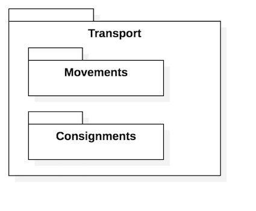
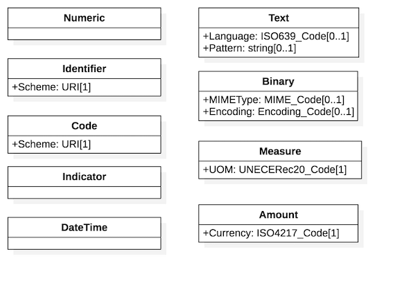
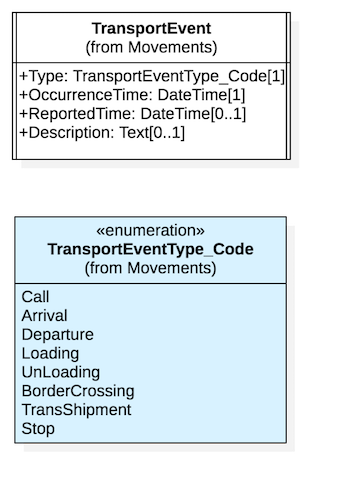
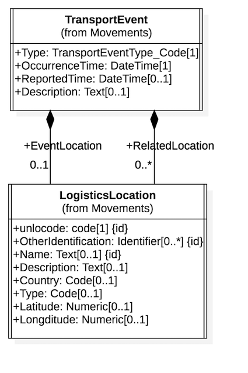
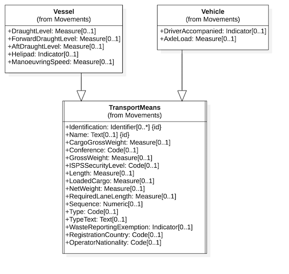
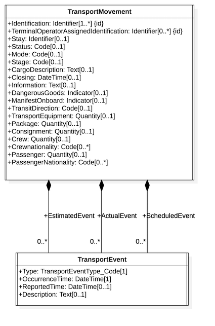
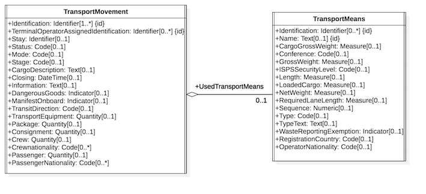
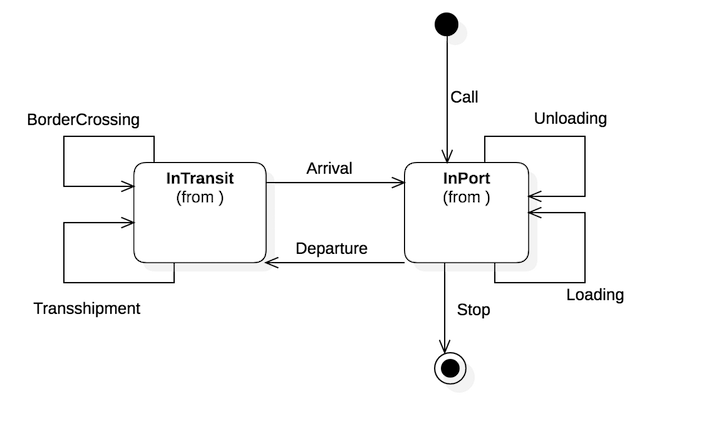

## Introduction

 edi3 semantic specifications are developed by business subject matter experts with deep experience in their relevant business domain. Graphical tools provide an effective means for non-technical modellers to express business semantics and communicate them to non-technical consumers. 

 UML is the most ubiquitous graphical modelling notation and is the basis for all edi3 semantic modelling. However, without guidance, different modellers are likely to use UML differently for the same purpose. Therefore this specification provides recommendations for the consistent use of UML for the representation of the data model and state lifecycle of information entities that are at the core of all edi3 semantic specifications. 

## Goals

This specification will have acheived its purpose when

* All edi3 semantic specifications are consistently represented as UML class and state lifecycle diagrams.
* Models can be successfully interchanged between different UML tools.
* Open API 3.0 interface specifications and JSON-LD ontologies can be generated from the UML models.

 Like all edi3 specifications, the editors have aimed for simplicity and ease of use buy the target audience (business modellers in this case).  Therefore we 

 * focus on only two UML diagram types (class diagrams and statechart diagrams), and 
 * use a limited set of standard UML constructs (avoiding un-necessary use of stereotypes), and
 * provide plentiful examples.

It is NOT a goal of this specification to provide guidance on best practices of information mnodelling. We assume that the reader is a capable infomration modeller that wishes to use the edi3 UML profile so that models are consistent and interchangeable.

## Status

This specification is at  status.  It will move to  when at least one UML tool supports the specification as an alpha prototype.

## Dependencies

Users of this specification will typically leverage existing semantic libraries such as the UN/CEFACT Core Component Library (CCL) or other data dictionaries based on ISO-11179. Therefore this specification maps UML constructs to both ISO-11179 and UN/CEFACT CCL.

Although this specification is inteneded to be independent of specific deployment technologies, the eid3 suite is generally targeted at REST API implementation by web developers.  Therefore, where necessary, we introduce concepts into the UML profile that will be necessary for the generation of complete OPEN API 3.0 specifications and JSON-LD ontologies.

## Glossary

|Phrase | Definition|
|------------ | ------------|
|CCL| UN/CEFACT Core Compomnent Library|
|UML|Unified Modelling Language|
|UOM| Unit of Measure|

 
## Licence

All material published on edi3.org including all parts of this specification are the intellectual property of the UN as per the [UN/CEFACT IPR Policy](https://www.unece.org/fileadmin/DAM/cefact/cf_plenary/plenary12/ECE_TRADE_C_CEFACT_2010_20_Rev2E_UpdatedIPRpolicy.pdf).

This Specification is free software; you can redistribute it and/or modify it under the terms of the GNU General Public License as published by the Free Software Foundation; either version 3 of the License, or (at your option) any later version. See http://www.gnu.org/licenses. 

## Change Process

This document is governed by the [2/COSS](http://rfc.unprotocols.org/spec:2/COSS/) (COSS).

## Language

The key words "MUST", "MUST NOT", "REQUIRED", "SHALL", "SHALL NOT", "SHOULD", "SHOULD NOT", "RECOMMENDED", "MAY", and "OPTIONAL" 
in this document are to be interpreted as described in IETF RFC 2119.

# Business domains

The highest level construct in edi3 modelling is the business domain.  A domain is a business subject area that groups a number of related information resources. 

* Domains are represented as a UML Package
* Domain names must be unique across edi3.org
* Domains may contain subdomains and, if so, subdomain names must be iunique within the parent doamin.
* Subdomains are related to the parent domain using a UML package conmtainment relationship.
* Domains and subdomains must have a description

### Example 

### API Serialisation Note

Subdomains are implemented as API definitions.  One OpenAPI3 file per lowest level domain. 

# Data types

Data types are represented as the "type" of a UML attribute.  

## Core Data Types

There are only 8 possible core types:  

| Data Type | Usage Rule |
|---|---|
| Text |Any string of unicode characters |
| Numeric |Any integer or floating point number|
| Binary | A binary file URL.  File type is indicated by file extension which must be a valid MIME type|
| DateTime | an ISO-8601 date/time string |
| Identifier | a controlled public identifier type such as a business registration number|
| Code | a code from a controlled list such as ISO-3166 country code|
| Indicator |  a yes/no, true/false, 1/0 boolean|
| Measure | A measured value with defined UOM from UNECE-Rec-20 |
| Amount | A financial amoiunt with defined currency from ISO-4217 |

### Example

### API Serialisation Note

Types will map to corresponding JSON Schema types as defined in relevant NDR specifications ([OpenAPI](https://edi3.org/api-ndr/) or [JSON-LD](https://edi3.org/json-ld-ndr/). Note that code and identifier types MUST resolve to unambiguous values at runtime and so MUST include the scheme URI.  For example a party `identification` element (with `identfier` type) for an Australian business would be serialised as`{"identification":"ato.gov.au/abn:123456789"}` where `ato.gov.au/abn` is the schemeURI and `123456789` is the ABN identifier value. The SchemeURI value SHOULD be compatible with the edi3 [resource discovery](https://edi3.org/discovery/) specification so that consumers can validate indentifier or code values at runtime.

## Qualified Types & Enumerations

In most cases, the core data types are sufficient for any use. However, in some cases it is useful to define restrictions as part of the model. The most common use is where a small numnber of stable code values are enumerated in the data model (as opposed to discuvered and validated at runtime). Common examples are entity status lifecycle values and party role enumerations. Qualified types are named using the convention {qualifier term}_{core type name}. The example shows the use of a qualified data type `TransportEventType_Code` to restrict the allowed values of the `Type` attribute of the `TransprotEvent` class.

### Example

### API Serialisation Note

Qualified types are implemented as JSON objects with specific proerties an/or enumerated values.

# Data elements

Every data element has globally unique name called the "dictionary entry name" of the form urn:org.unece:domain.class.property - for example "urn:org.unece:transport.transportevent.occurrencetime"

Simple data elements are represented as attributes of UML classes - for example `OccurrenceTime` in `TransportEvent` class 
Complex data elements are represented as containment relationships (UML aggregation or composition) from source UML classes - for example `EventLocation` from `TransportEvent` class.

* Class names MUST be unique within a domain.
* Attribute names MUST be unique within a class.  
* Containment relationship names MUST be unique within the source class.
* All classes, attributes, and containment relationships MUST include a description which provides a meaningful definition of the data element.
* All attributes and containment relationship (target end) MUST have a cardinality.

### Example

### API Serialisation Note

UML Classes map to JSON Scherma objects and UML attributes become properties of the JSON Schema object. [1] cardinalitied map the the `required` shema property. UML cardinalities [0..*] or [1..*] map to a JSON array. 

# Relationships

The edi3 UML profile includes four standard UML class diagram relationship types, all of which have the standard UML meaning but have specific treatment when serialising models to JSON.

## Generalisation Relationship

The UML generalisation relationship is used to inicate sub-types or specialisations of an information resource.  For example, a `Vessel` is a type of `TransportMeans`.  The specialised class (ie `Vessel`) inherits all the properties of the general class (ie `TransportMeans`).  This modelling approach permits the separation of specific proerties such as `Helipad` (only for vessels) and `AxleLoad` (only for vehicles)

### Example 

### API Serialisation Note

The concrete class contains all propertiers of the abstract - so for example, the API user will just see a `Vessel` resource will the combined properties of Vessel and TransportMeans.

## Composition Relationship

The UML composition relationship is used to indicate a containment relationship between two classes where the contained class is part of the containing class.  It is essentially a complex property of the parent class that has no meaning without the parent context.  For example the 1TransportEvent1 class describes the sequence of scheduled, estimated, or actual events that consititute the movement record of a `TransportMovement`.

### Example

### API Serialisation Note

The target class and all it's attributes becomne part of the schema of the parent - ie $ref to a nested data structure. So, in the example above, `GET /TransportMovement` would return all properties of the `TransportMovement` class AND all properties of the contained `TransportEvent` as a nested array structure.

## Aggregation Relationship

The UML aggregation relationship is used to indicate a containment relationship between two classes where the contained class may be re-used by other classes and has meaning independent of the relationship. It is essentially a link to a relevant but independent entity. For example a `TransportMeans` (such as a Vessel) is an independent concept from from a `TransportMovement` (such as a `Voyage`).  Both can exist and be meningful in isolation but clearly the the vessel identity is an important aspect of a voyage.

### Example

### API Serialisation Note

Only the `{id}` properties of the target class are embedded into the source schema. So, in the example above, `GET /TransportMovement would return all properties of `TransportMovement` and only the `Identification` and `Name` of the associated `TransportMeans` - because those are the properties with the UML 'isID' flag set. The JSON API header would also carry a {link} element that holds the URL of the `Transportmeans` resource. Consumers that also want to know addiotnal properties of the `TransportMeans` such as `GrossWeight` would simply follow the link with a `GET /TrannsportMeans/{id}`

## Relationship Class

A UML relationship class is used when the relationship itself requires extra properties. The relatiionship class can be added to either the composition or aggregation relationship. For example, there are a number of different `Party` types that may participate in a `TransportMovement`. These can be distinguished via a `Role` property of the relationship as shown in the example below.  

### Example 

### API Serialisation Note

The properties of association classes are added as extra properties of the target class during serialisation. So, in the example above, the JSAON schema would define an object `TransportMovementParty` as an arraye property of `TransportMovement` and the properties of the array object would be `Role` (from the relationship class) and `Identification`, `Name` (from `Party` class).

## Directed Association Relationship

The UML directed association relationship is used to indicate a (non containment) relationship between two classes. For the purposes of this specification it is ued for two purposes

* When used between any two UML Interfaces, it indicates a URL to a linked web resource 
* When used between any two UML classes, it indiates a semantic relationship 

### Example

### API Serialisation Note

When used between two interfaces, indicates that the source API MAY include a HATEOAS style URL link to the target resource, implemented using [JSON-API](https://jsonapi.org/) `"links"` element. When used between two classes, the association is ignored for API serialisation (but is included in the JSON-LD ontology serialisation)

# Interfaces

An interface is a standard UML stereotype which is based on a UML class. It is normally used to indicate the behaviour of external interfaces and so is a good fit to represent a RESTful API. An interface:

## Interface Data Model

* MUST be modelled as a UML class with stereotype `<<interface>>`
* MUST be named using a noun, not a verb.
* MUST be the target of a UML `<<realisation>>` relationship where the source is a UML class hierarchy that represents the resource information model.
* MUST include a styate machine model that defines the behaviour of the reource object (see more on this in the next section)
* MUST include two mandatory UML attributes 
   * id:string - represnting the unique identifier of the resource instance (usually a GUID)
   * status:code - representing the current state of the resource instance
* MUST include one or more UML operations that define the allowed actions on the resource which SHOULD be named as http verbe (GET / POST / PATCH etc).
* MAY be the target of one or more UML composition relationships where the sources MUST be another `<<interface>` class. This is used to define sub-resource relationships.
* MAY be the target of one of or more UML directed association relationshoips where the source MUST be other `<<interface> `class. This is used to represent URL links to independent but related resources such as the invoice for a shipment or the bill of lading for a consignment.

### Example

### API Serialisation Note

* The UML `<<interface>>` type will map to a RESTful API web resource such as `https://api.acme.com/v1/transportmovements/{123456789}`.  The mapping rules for Open API 3.0 specification generation are defined in the Open API 3.0 NDR specification.
* Resopurce models are deliberately kept simple and so do not attempt to model things like different structures for different types of PATCH operations or a list of filters allowed in GET collection actions. These things are likely to vary by implementation.  Models and generated OpenAPI specifications published by edi3.org represent only the minimum conformant behaviour for an implemention.

## Interface behaviour Model

Each `<<interface>>` UML class MUST have an embedded UML state machine model that describes the state lifecycle of a resource. Resource state lifecvycles are important because they describe the set of allowed states and allowed transitions between states. For example an `invoice` resource may transition through `received`, `approved`, `disputed`, `amended`, and `paid`.  The precise meanings of each state can have signifcant legal or commercial significance (eg financing an `approved` invoice will have less risk and hence lower cost than financing a `received` invoice)

The UML profile for state lifecycles is very simple as it is just a minimal UML state machine

* MUST iunclude an initial and final state and at least one simple state.
* MUST include at least one state transition into and out of each state.
* state names MUST be unique within one state lifecycle and represent the list of allowed values for the "status" attribute of the parent resource.
* All transitions MUST have a UML trigger that describes the business event that triggered the transition.
* triggers SHOULD include a target operation that links to the operation (POST/PATCH etc) of the resource action that triggered the event.

### Example

### API Serialisation Note

The state lifecycle is implemented as OpenAPI3 callbacks and subscriptions. A subscription to the resource should result in a callback to the subscriber for every transition in the state lifecycle.  The callbacks are implemented as "light ping" messages that simply advise the resource URL and the from/to state and trigger event. Subscribers may then decide whehther to GET the resource /subresource that has changed.

# Complete Example

## Model

The trasnsport movements example model provided below incorporates all the UML constructs covered in this specification. 

The starUML source file for this model is [here](SampleModel.mdj)

## Serialisation

When the generator works - put a link to the generated API spec here.

